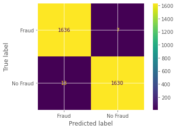

```python
# initialize and train new model 
model_under = DecisionTreeClassifier()
start = time.time()
model_under.fit(X_train_under,y_train_under)
stop = time.time()
print(f"New fitting time after undersamplsing is: {stop - start:.2f}s")
print(f"The accuracy score of the model_under is: {model_under.score(X_test_under,y_test_under)*100:.2f}%")
```
---
Output:
New fitting time after undersamplsing is: 0.06s
The accuracy score of the model_under is: 99.39%

---
